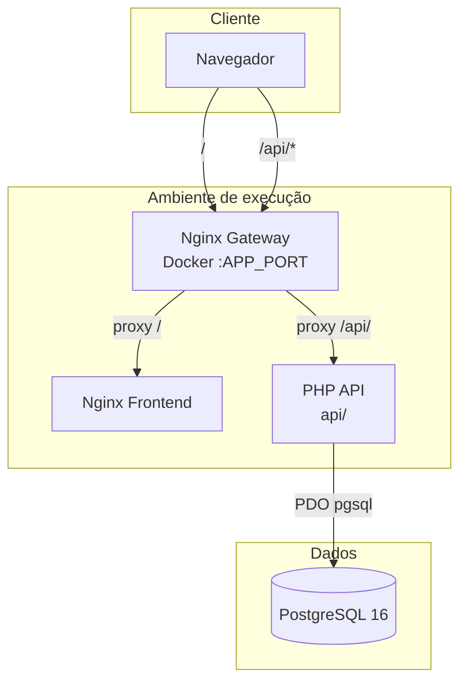
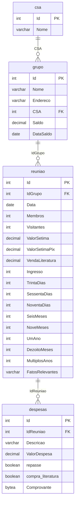
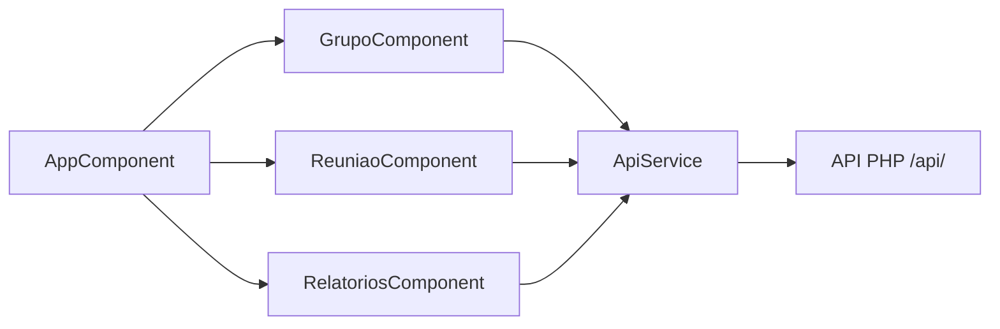

# Arquitetura — Sistema de Tesouraria (Tesoureiro)

Documentação interna para manutenção. Última revisão com base no código em agosto/2026.

## Visão geral

O **Tesoureiro** é um sistema de tesouraria para grupos religiosos. Permite cadastrar **grupos** vinculados a um **CSA** (Comunidade de Serviço de Assistência), registrar **reuniões** semanais com arrecadação e presença, lançar **despesas** por reunião (com comprovante opcional) e gerar **relatórios** mensais com saldo acumulado.

Arquitetura em três camadas desacopladas:

| Camada | Tecnologia | Localização |
|--------|------------|-------------|
| Frontend | Angular 17 (standalone) | `frontend/` |
| API REST | PHP procedural + PDO | `api/` |
| Banco | PostgreSQL 16 | externo ou via scripts em `docker/postgres/` |

**Sem autenticação** — decisão de produto vigente. Qualquer cliente com acesso à URL pode ler e alterar dados.

## Diagrama de camadas



Em **XAMPP** ou **InfinityFree**, o gateway é substituído pelo Apache do host: frontend estático + pasta `api/` no mesmo domínio.

## Estrutura de pastas

```
tesoureiro/
├── api/                          # Backend REST
│   ├── config/
│   │   ├── database.php          # Conexão PDO (não versionado; copiar de database.example.php)
│   │   └── database.example.php  # Template de conexão
│   ├── grupo/index.php           # CRUD grupos
│   ├── reuniao/index.php         # CRUD reuniões
│   ├── csa/index.php             # Listagem CSA (somente leitura)
│   ├── despesas/index.php        # CRUD despesas
│   ├── relatorios/index.php      # Relatórios e saldo acumulado
│   ├── test.php                  # Diagnóstico de conexão
│   └── .htaccess                 # CORS nos arquivos PHP
├── frontend/                     # Angular 17
│   └── src/app/
│       ├── app.component.*       # Shell com abas (sem rotas ativas)
│       ├── components/
│       │   ├── grupo/            # Aba Grupos
│       │   ├── reuniao/          # Aba Reuniões (+ despesas embutidas)
│       │   └── relatorios/       # Aba Relatórios (+ export DOCX)
│       ├── services/api.service.ts
│       └── app.routes.ts         # Vazio — navegação por abas no AppComponent
├── database/                     # Migrações históricas (MySQL) e dumps
├── docker/
│   ├── php/                      # Dockerfile da API
│   ├── nginx/                    # Gateway e frontend estático
│   └── postgres/init/            # Schema inicial PostgreSQL
├── scripts/                      # Backup, restore, migração MySQL→PG
├── docker-compose.yml
├── docker-compose.dev.yml
└── .env.example
```

## Stack tecnológica

| Item | Versão / detalhe |
|------|------------------|
| PHP | 7.4+ (PDO PostgreSQL) |
| Angular | 17, componentes standalone |
| PostgreSQL | 16 |
| HTTP | REST JSON, UTF-8 |
| Deploy | Docker (opcional), XAMPP local, InfinityFree |
| Libs frontend | `html-docx-js-typescript` (exportação de relatórios para Word) |

Padrões adotados:

- **API procedural**: um `index.php` por recurso, `switch` por método HTTP.
- **Sem ORM**, sem framework PHP, sem NgRx.
- **Identificadores PostgreSQL** em PascalCase entre aspas (`"Id"`, `"Nome"`); exceção: colunas `repasse` e `compra_literatura` em minúsculas na tabela `despesas`.
- **CORS** aberto (`Access-Control-Allow-Origin: *`) em todos os endpoints.

## Modelo de dados

### Diagrama ER



> O schema em `docker/postgres/init/01-schema.sql` **não declara FOREIGN KEY** explícitas; os relacionamentos são lógicos e mantidos pela aplicação.

### Tabelas

#### `csa`

| Coluna | Tipo | Obrigatório | Descrição |
|--------|------|-------------|-----------|
| `Id` | SERIAL PK | sim | Identificador |
| `Nome` | VARCHAR(400) | sim | Nome do CSA |

Dados seed: CSA ABC, CSA Mauá Sem Fronteiras.

#### `grupo`

| Coluna | Tipo | Obrigatório | Descrição |
|--------|------|-------------|-----------|
| `Id` | SERIAL PK | sim | Identificador |
| `Nome` | VARCHAR(4000) | sim | Nome do grupo |
| `Endereco` | VARCHAR(4000) | sim | Endereço |
| `CSA` | INTEGER | sim | Referência a `csa.Id` |
| `Saldo` | DECIMAL(12,2) | sim | Saldo inicial de referência |
| `DataSaldo` | DATE | não | Data de referência do saldo inicial |

#### `reuniao`

| Coluna | Tipo | Obrigatório | Descrição |
|--------|------|-------------|-----------|
| `Id` | SERIAL PK | sim | Identificador |
| `IdGrupo` | INTEGER | sim | Grupo da reunião |
| `Data` | DATE | sim | Data da reunião |
| `Membros` | INTEGER | sim | Quantidade de membros |
| `Visitantes` | INTEGER | sim | Quantidade de visitantes |
| `ValorSetima` | DECIMAL(12,2) | sim | Arrecadação em dinheiro |
| `ValorSetimaPix` | DECIMAL(12,2) | sim | Arrecadação via PIX |
| `VendaLiteratura` | DECIMAL(12,2) | não | Venda de literatura (default 0 na API) |
| `Ingresso` … `MultiplosAnos` | INTEGER | sim | Contadores de novos membros por período |
| `FatosRelevantes` | VARCHAR(4000) | sim | Texto livre |

#### `despesas`

| Coluna | Tipo | Obrigatório | Descrição |
|--------|------|-------------|-----------|
| `Id` | SERIAL PK | sim | Identificador |
| `IdReuniao` | INTEGER | sim | Reunião vinculada |
| `Descricao` | VARCHAR(400) | sim | Descrição da despesa |
| `ValorDespesa` | DECIMAL(12,2) | sim | Valor |
| `repasse` | BOOLEAN | não | Marca despesa como repasse |
| `compra_literatura` | BOOLEAN | não | Marca compra de literatura |
| `Comprovante` | BYTEA | não | Arquivo binário (imagem/PDF) |

### Migrações

| Arquivo | Observação |
|---------|------------|
| `docker/postgres/init/01-schema.sql` | Schema canônico PostgreSQL |
| `docker/postgres/init/02-sequences.sql` | Ajuste de sequences pós-importação |
| `database/20260204_inclusao_campos.sql` | Histórico MySQL: `VendaLiteratura`, `repasse`, `compra_literatura` |
| `database/20260307_comprovante_opcional.sql` | Histórico MySQL: `Comprovante` nullable |
| `database/20260730_valor_despesa_decimal.sql` | Histórico MySQL: tipo decimal |
| `database/*.sql` / `*.dump` | Backups e dumps de migração |

Novas alterações de schema devem ir em `database/` (PostgreSQL) via agent `dba`.

## APIs REST

Base URL: `{host}/api/{recurso}/` (barra final usada pelo `ApiService`).

Resumo dos recursos:

| Recurso | Métodos | Descrição |
|---------|---------|-----------|
| `/api/grupo/` | GET, POST, PUT, DELETE | CRUD de grupos |
| `/api/reuniao/` | GET, POST, PUT, DELETE | CRUD de reuniões |
| `/api/csa/` | GET | Listagem de CSAs |
| `/api/despesas/` | GET, POST, PUT, DELETE | CRUD de despesas |
| `/api/relatorios/` | GET | Relatórios mensais e saldo acumulado |
| `/api/test.php` | GET | Teste de conexão (texto plano) |

**Detalhamento completo** (parâmetros, corpos JSON, códigos de resposta): ver [api.md](./api.md).

### Convenções gerais

- **Content-Type**: `application/json; charset=utf-8`
- **Corpo**: JSON no POST/PUT; parâmetros de filtro e ID no GET/DELETE via query string
- **Erros**: objeto `{ "message": "...", "error": "..." }` com HTTP 4xx/5xx
- **Sucesso mutação**: `{ "message": "...", "id": N }` (POST retorna 201)
- **Comprovante**: enviado/recebido em Base64; armazenado como BYTEA no PostgreSQL

## Fluxo frontend

### Navegação

O `AppComponent` controla três abas via `activeTab` (`grupos` | `reunioes` | `relatorios`). O Angular Router está configurado mas **sem rotas** (`app.routes.ts` vazio).



### ApiService

Centraliza todas as chamadas HTTP em `frontend/src/app/services/api.service.ts`. A URL base vem de `environment.apiUrl` (padrão: `/api`).

### Aba Grupos (`GrupoComponent`)

- Carrega lista de grupos e CSAs no `ngOnInit`
- Modal para criar/editar grupo (Nome, Endereço, CSA, Saldo, DataSaldo)
- Grid com nome do CSA (`CSA_Nome` retornado pelo JOIN na API)
- Exclusão com confirmação

### Aba Reuniões (`ReuniaoComponent`)

- **Filtros obrigatórios** (todos os três): Grupo, Mês, Ano — só então carrega reuniões
- Modal principal: dados da reunião + totais calculados (sétima + despesas)
- Despesas gerenciadas em sub-modal; só disponíveis após salvar a reunião (precisa de `Id`)
- Upload de comprovante convertido para Base64 no frontend
- Flags `repasse` e `compra_literatura` por despesa

### Aba Relatórios (`RelatoriosComponent`)

- Filtros: Grupo, Mês, Ano (inicializa mês/ano atual)
- Tipos: **geral** (totais do mês) e **detalhado** (reuniões + despesas linha a linha)
- Relatório detalhado também busca **saldo acumulado** (`tipo=saldo-acumulado`)
- Exportação para DOCX via `html-docx-js-typescript`

### Ambientes

| Arquivo | `apiUrl` |
|---------|----------|
| `environment.ts` (dev) | `/api` |
| `environment.production.ts` | `/api` |

Para XAMPP sem gateway Docker, alterar para `http://localhost/tesoureiro/api`.

## Configuração

### Banco de dados (API)

`api/config/database.php` (copiar de `database.example.php`):

| Variável env | Padrão local | Descrição |
|--------------|--------------|-----------|
| `DB_HOST` | `localhost` | Host PostgreSQL |
| `DB_PORT` | `5432` | Porta |
| `DB_NAME` | `tesouraria` | Nome do banco |
| `DB_USER` | `postgres` | Usuário |
| `DB_PASSWORD` | `''` | Senha |

No Docker, o `docker-compose.yml` injeta essas variáveis no container `api`.

### Docker

```bash
cp .env.example .env
docker compose up -d --build
```

| Variável `.env` | Padrão | Uso |
|-----------------|--------|-----|
| `DB_*` | ver `.env.example` | Conexão PostgreSQL externo |
| `APP_PORT` | `8099` | Porta do gateway Nginx |
| `MYSQL_*` | — | Apenas scripts de migração MySQL→PG |

- **Produção Docker**: gateway em `http://localhost:{APP_PORT}` — `/api/` → PHP, `/` → frontend estático
- **Dev Docker** (`docker-compose.dev.yml`): volume bind em `./api` para hot-reload PHP
- **PostgreSQL**: não há container PG no compose; usar banco externo (`host.docker.internal` no Windows/Mac)

### XAMPP / InfinityFree

1. Configurar `api/config/database.php` com credenciais do PostgreSQL
2. Publicar pasta `api/` no servidor
3. Build Angular (`ng build --configuration production`) e publicar `frontend/dist/tesouraria/`
4. Garantir que `/api` aponte para a pasta PHP (mesmo domínio evita CORS)

### Diagnóstico

Acessar `/api/test.php` para validar conexão PDO e contagem de registros em `grupo` e `reuniao`.

## Decisões arquiteturais atuais

| Decisão | Justificativa |
|---------|---------------|
| Sem autenticação | Escopo inicial do produto; uso interno/confiável |
| REST procedural (sem framework PHP) | Simplicidade, deploy em hospedagem compartilhada |
| Um arquivo por recurso | Fácil localizar e alterar endpoints |
| Angular standalone sem rotas | SPA simples com abas; rotas reservadas para evolução |
| PostgreSQL com identificadores quotados | Compatibilidade pós-migração do MySQL |
| Comprovantes em BYTEA | Evita sistema de arquivos; trade-off de tamanho no banco |
| CORS aberto | Frontend e API podem estar em origens diferentes no dev |
| CSA somente leitura na API | Cadastro de CSA feito direto no banco/seed |

## Pontos de atenção para manutenções futuras

### Segurança e operação

- **Sem auth**: expor em rede pública exige revisão de produto ou ADR para login
- `api/grupo/index.php` tem `display_errors = 1` — risco de vazamento de stack trace em produção
- CORS `*` e ausência de rate limiting
- Credenciais em `database.php` não devem ser commitadas

### Integridade de dados

- Sem FK no schema: exclusão de grupo/reunião pode deixar órfãos
- Exclusão de reunião **não** remove despesas em cascata (verificar comportamento desejado)
- Comprovantes grandes em BYTEA impactam backup e performance de listagens (GET por id evita isso na listagem)

### Frontend

- Tipagem `any` em modelos e respostas — refatorar para interfaces se o sistema crescer
- Filtros de reunião obrigatórios são regra de UI, não da API (GET sem filtro retorna todas)
- Rotas Angular vazias — ao adicionar rotas, migrar navegação por abas ou manter consistência

### API

- Validação mínima (presença de campos, não formato/tipo)
- `VendaLiteratura` opcional no POST (default 0) mas outros campos numéricos são obrigatórios mesmo quando zero
- Relatório `saldo-acumulado` usa lógica complexa de datas — alterações em saldo inicial exigem testes de regressão

### Evolução sugerida (fora de escopo imediato)

- ADR antes de introduzir autenticação, ORM ou NgRx
- Constraints FK e ON DELETE no PostgreSQL
- Paginação nas listagens
- Armazenamento de comprovantes em object storage
- Tipos TypeScript e contratos OpenAPI sincronizados com `api.md`

## Documentos relacionados

- [api.md](./api.md) — referência detalhada dos endpoints
- [README.md](../../README.md) — instalação e uso
- [`.cursor/rules/orquestracao-agentes.mdc`](../rules/orquestracao-agentes.mdc) — delegação por camada (dba, dev-php, frontend-dev)
