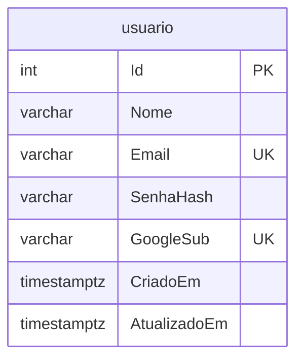
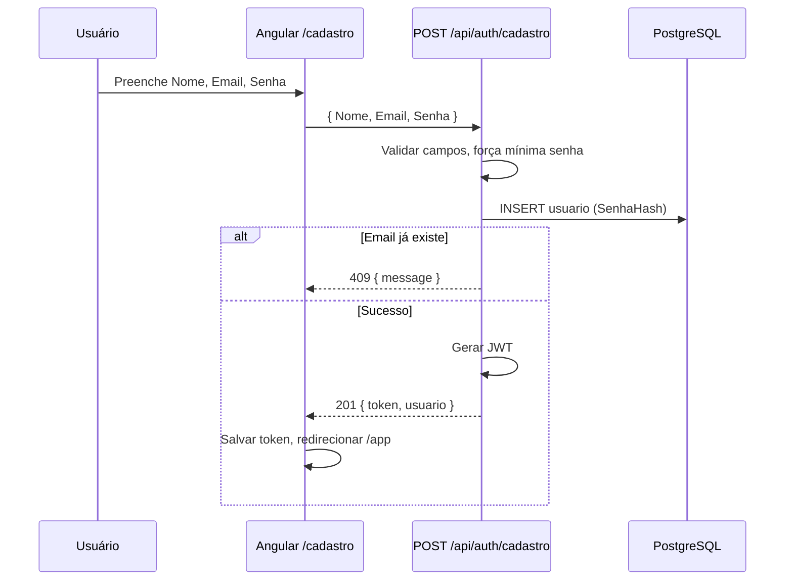
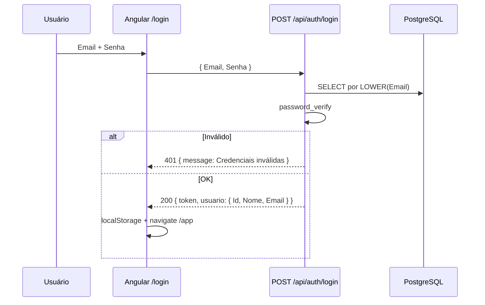
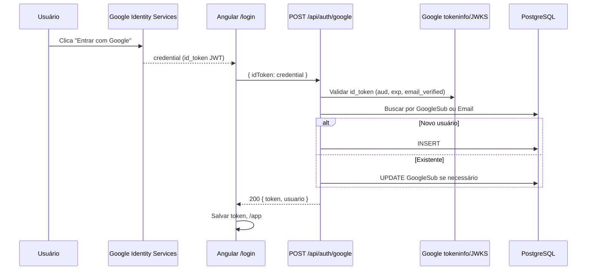
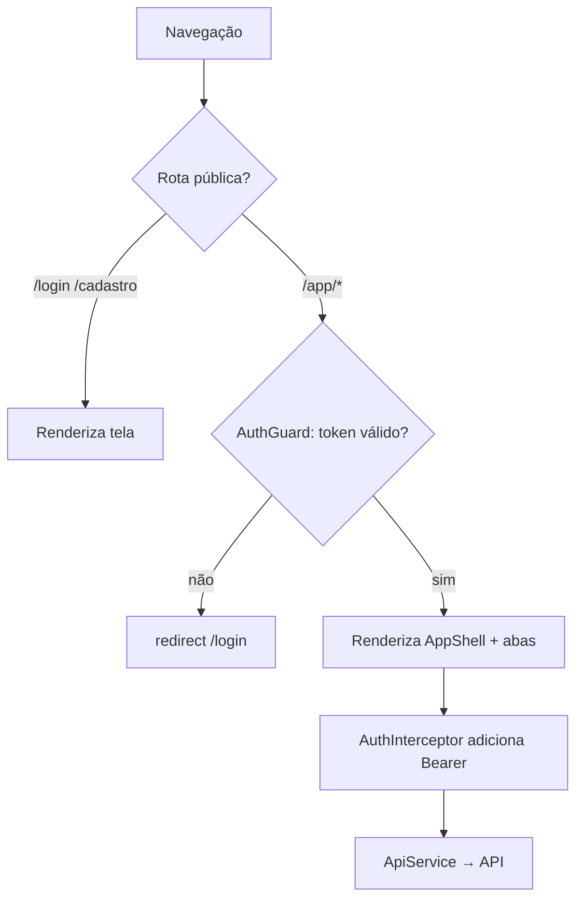
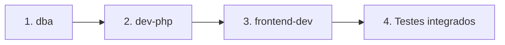

# Plano de implementação — Autenticação e renomeação "Servidor de NA"

Documento acionável para os agents `dba`, `dev-php` e `frontend-dev`.  
Decisão registrada em [decisoes/20260814-autenticacao-simples.md](./decisoes/20260814-autenticacao-simples.md).

---

## 1. Visão geral da solução

O **Servidor de NA** (antes "Sistema de Tesouraria") passa a exigir login antes de acessar as funcionalidades de tesouraria. A autenticação é **stateless**: após login bem-sucedido, a API emite um **JWT** assinado com segredo server-side; o Angular armazena o token e envia `Authorization: Bearer …` em todas as requisições aos recursos protegidos.

```mermaid
flowchart TB
    subgraph publico [Rotas públicas]
        Login[/login]
        Cadastro[/cadastro]
    end

    subgraph autenticado [Área autenticada]
        App[/app]
        Grupos[Grupos]
        Reunioes[Reuniões]
        Relatorios[Relatórios]
    end

    subgraph api [API PHP]
        AuthEP[api/auth/]
        Middleware[config/auth.php]
        Recursos[grupo reuniao despesas relatorios csa]
    end

    subgraph dados [PostgreSQL]
        Usuario[(usuario)]
        Dominio[(grupo reuniao despesas csa)]
    end

    Login --> AuthEP
    Cadastro --> AuthEP
    AuthEP --> Usuario
    AuthEP -->|JWT| App
    App --> Grupos
    App --> Reunioes
    App --> Relatorios
    Grupos --> Recursos
    Reunioes --> Recursos
    Relatorios --> Recursos
    Recursos --> Middleware
    Middleware --> Dominio
```

### Princípios alinhados ao codebase atual

| Aspecto | Padrão existente | Como auth se encaixa |
|---------|------------------|----------------------|
| API | Um `index.php` por recurso, `switch` por método | Novo `api/auth/index.php` no mesmo estilo |
| Banco | Tabelas minúsculas, colunas PascalCase entre aspas | Tabela `usuario` com `"Id"`, `"Nome"`, etc. |
| Frontend | Standalone, sem NgRx | `AuthService` + `HttpInterceptor` (padrão Angular) |
| HTTP | JSON UTF-8, erros `{ message, error? }` | Mesmo contrato nos endpoints de auth |
| CORS | `Access-Control-Allow-Origin: *` | Mantido — JWT no header não exige cookies |

---

## 2. Modelo de dados

### Tabela `usuario`

| Coluna | Tipo | Obrigatório | Descrição |
|--------|------|-------------|-----------|
| `"Id"` | SERIAL PK | sim | Identificador |
| `"Nome"` | VARCHAR(200) | sim | Nome de exibição (cabeçalho "Bem-vindo") |
| `"Email"` | VARCHAR(320) | sim | E-mail único (case-insensitive na aplicação) |
| `"SenhaHash"` | VARCHAR(255) | não | Hash Argon2id/bcrypt; `NULL` se conta só Google |
| `"GoogleSub"` | VARCHAR(255) | não | Subject do Google (`sub` do id_token); único quando preenchido |
| `"CriadoEm"` | TIMESTAMPTZ | sim | Default `NOW()` |
| `"AtualizadoEm"` | TIMESTAMPTZ | sim | Atualizado em login/cadastro |

### Constraints e índices

```sql
-- Esboço para o agent dba (não executar daqui)
UNIQUE ("Email")
UNIQUE ("GoogleSub")  -- partial: WHERE "GoogleSub" IS NOT NULL
CHECK (
  "SenhaHash" IS NOT NULL OR "GoogleSub" IS NOT NULL
)
CREATE UNIQUE INDEX usuario_email_lower_idx ON usuario (LOWER("Email"));
```

### Regras de negócio (aplicação)

1. **Cadastro e-mail/senha:** exige `Nome`, `Email`, `Senha`; grava `password_hash($senha, PASSWORD_ARGON2ID)` (fallback `PASSWORD_BCRYPT` se Argon2 indisponível).
2. **Login Google:** se `Email` do token já existe → atualizar `"GoogleSub"` e `"Nome"` se vazio; se não existe → criar usuário com `SenhaHash = NULL`.
3. **Login e-mail/senha:** recusar se `SenhaHash` for `NULL` (conta Google-only) com mensagem orientando usar Google.
4. **Sem tabela de sessão na v1** — logout é remoção do token no cliente.

### Diagrama ER (extensão)



> **v1:** nenhuma FK entre `usuario` e `grupo`/`csa`. Todo usuário autenticado acessa o domínio completo. RBAC fica para ADR futura.

---

## 3. Fluxos

### 3.1 Cadastro (e-mail/senha)



### 3.2 Login (e-mail/senha)



### 3.3 Login Google



**Frontend:** carregar script `https://accounts.google.com/gsi/client` e usar `google.accounts.id.initialize` com `data-client_id` = `environment.googleClientId`. Botão oficial ou `renderButton`.

### 3.4 Logout

1. Usuário clica "Sair" no cabeçalho.
2. Angular remove `token` e dados de `usuario` do `localStorage`.
3. (Opcional) `POST /api/auth/logout` retorna `200` — sem efeito server-side na v1.
4. Redireciona para `/login`.

### 3.5 Proteção de rotas e API

**Frontend**



- `AuthGuard`: verifica presença de token e (opcional) expiração decodificada no client; em 401 da API → logout + `/login`.
- Rotas sugeridas:

| Rota | Componente | Guard |
|------|------------|-------|
| `/login` | `LoginComponent` | `GuestGuard` (redireciona para `/app` se já logado) |
| `/cadastro` | `CadastroComponent` | `GuestGuard` |
| `/app` | redirect → `/app/grupos` | `AuthGuard` |
| `/app/grupos` | `GrupoComponent` | `AuthGuard` |
| `/app/reunioes` | `ReuniaoComponent` | `AuthGuard` |
| `/app/relatorios` | `RelatoriosComponent` | `AuthGuard` |
| `''` | redirect → `/app` ou `/login` | — |
| `**` | redirect `/app` | — |

**API**

- No topo de cada `api/{recurso}/index.php` (exceto `auth`), após CORS:

```php
require_once __DIR__ . '/../config/auth.php';
$usuario = requireAuth(); // retorna payload JWT ou responde 401 e exit
```

- `test.php` permanece público (diagnóstico); documentar que não deve ficar exposto em produção pública.

---

## 4. API — endpoints `api/auth/`

Base: `{host}/api/auth/` — mesmo padrão de CORS e OPTIONS dos demais recursos.

### POST `/api/auth/cadastro`

**Corpo:**

```json
{
  "Nome": "Maria Silva",
  "Email": "maria@exemplo.org",
  "Senha": "minimo8chars"
}
```

| Validação | Regra |
|-----------|-------|
| `Nome` | não vazio, trim, máx. 200 |
| `Email` | formato válido, máx. 320 |
| `Senha` | mín. 8 caracteres (v1) |

**Respostas:**

| HTTP | Corpo |
|------|-------|
| `201` | `{ "message": "Usuário criado", "token": "<jwt>", "usuario": { "Id": 1, "Nome": "...", "Email": "..." } }` |
| `400` | `{ "message": "Dados inválidos", "error": "..." }` |
| `409` | `{ "message": "E-mail já cadastrado" }` |

### POST `/api/auth/login`

**Corpo:** `{ "Email": "...", "Senha": "..." }`

| HTTP | Corpo |
|------|-------|
| `200` | `{ "token": "<jwt>", "usuario": { "Id", "Nome", "Email" } }` |
| `401` | `{ "message": "Credenciais inválidas" }` |
| `400` | `{ "message": "Dados incompletos" }` |

### POST `/api/auth/google`

**Corpo:** `{ "idToken": "<credential do GIS>" }`

| HTTP | Corpo |
|------|-------|
| `200` | `{ "token": "<jwt>", "usuario": { "Id", "Nome", "Email" } }` |
| `401` | `{ "message": "Token Google inválido" }` |

**Validação backend (v1 recomendada):**

```
GET https://oauth2.googleapis.com/tokeninfo?id_token={idToken}
```

Verificar: `aud` === `GOOGLE_CLIENT_ID`, `email_verified` === `true`, `exp` não expirado. Extrair `sub`, `email`, `name`.

> **v2:** validar assinatura via JWKS sem chamar `tokeninfo` (menos dependência de rede).

### GET `/api/auth/me`

**Header:** `Authorization: Bearer <token>`

| HTTP | Corpo |
|------|-------|
| `200` | `{ "Id": 1, "Nome": "...", "Email": "..." }` |
| `401` | `{ "message": "Não autorizado" }` |

Usado no bootstrap do app para repopular nome no cabeçalho após refresh da página.

### POST `/api/auth/logout` (opcional v1)

| HTTP | Corpo |
|------|-------|
| `200` | `{ "message": "Logout realizado" }` |

Sem estado server-side na v1.

### Payload do JWT (claims)

```json
{
  "sub": 1,
  "email": "maria@exemplo.org",
  "nome": "Maria Silva",
  "iat": 1690000000,
  "exp": 1690028800
}
```

- Algoritmo: **HS256**
- TTL sugerido: **8 horas** (`JWT_TTL_SECONDS=28800`)
- Segredo: `JWT_SECRET` (mín. 32 bytes aleatórios)

### Erros nos recursos protegidos (após auth)

| HTTP | Quando |
|------|--------|
| `401` | Token ausente, expirado ou assinatura inválida |
| `403` | Reservado para RBAC futuro |

---

## 5. Frontend — mudanças em `frontend/`

### 5.1 Renomeação "Servidor de NA"

| Arquivo | De | Para |
|---------|-----|------|
| `src/app/app.component.html` | `<h1>Sistema de Tesouraria</h1>` | `<h1>Servidor de NA</h1>` + bloco boas-vindas |
| `src/index.html` | `<title>Tesouraria</title>` | `<title>Servidor de NA</title>` |

**Referências secundárias** (podem ser atualizadas na mesma entrega ou em follow-up):

- `README.md` (título)
- `DEBUG.md`, `.cursor/docs/arquitetura.md`, agents em `.cursor/agents/`
- `package.json` name `tesouraria-frontend` e `angular.json` project `tesouraria` — **não renomear na v1** (impacto em build/deploy)

### 5.2 Novos arquivos sugeridos

```
frontend/src/app/
├── auth/
│   ├── login/
│   │   ├── login.component.ts|html|css
│   └── cadastro/
│       └── cadastro.component.ts|html|css
├── guards/
│   ├── auth.guard.ts
│   └── guest.guard.ts
├── interceptors/
│   └── auth.interceptor.ts
├── services/
│   └── auth.service.ts
└── models/
    └── usuario.model.ts
```

### 5.3 `AuthService` (responsabilidades)

- `cadastrar(nome, email, senha)`, `login(email, senha)`, `loginGoogle(idToken)`, `logout()`, `getToken()`, `getUsuario()`, `isAuthenticated()`
- `carregarUsuarioAtual()` → `GET /api/auth/me` no `APP_INITIALIZER` ou `ngOnInit` do shell
- Persistência: `localStorage` keys `na_token`, `na_usuario` (prefixo evita colisão)

### 5.4 Cabeçalho global

No shell autenticado (`AppComponent` ou novo `AppShellComponent`):

```html
<header>
  <h1>Servidor de NA</h1>
  <div class="user-bar" *ngIf="usuario">
    Bem-vindo, {{ usuario.Nome }}
    <button type="button" (click)="logout()">Sair</button>
  </div>
</header>
```

- Exibir em **todas** as telas da área `/app/*` (login/cadastro sem cabeçalho de boas-vindas ou com layout simplificado).
- Estilizar em `app.component.css` reutilizando classes `.header` existentes.

### 5.5 `AuthInterceptor`

- Clonar request com header `Authorization` quando houver token.
- Em resposta `401` (exceto chamadas a `/auth/login` e `/auth/cadastro`): `logout()` + navegar `/login`.

### 5.6 `ApiService`

- Manter como está; o interceptor cuida do Bearer.
- Opcional: método `getMe()` delegando ao `AuthService`.

### 5.7 Ambientes

`environment.ts` e `environment.production.ts`:

```typescript
export const environment = {
  production: false,
  apiUrl: '/api',
  googleClientId: 'SEU_CLIENT_ID.apps.googleusercontent.com'
};
```

`googleClientId` é **público** (restrito por origem no Google Cloud Console).

### 5.8 `main.ts`

Registrar interceptor:

```typescript
import { provideHttpClient, withInterceptors } from '@angular/common/http';
// authInterceptor como HttpInterceptorFn (Angular 17)
```

Migrar de `HttpClientModule` para `provideHttpClient` se necessário para interceptors funcionais.

### 5.9 Google no frontend

1. Registrar origens autorizadas no [Google Cloud Console](https://console.cloud.google.com/) → APIs & Services → Credentials → OAuth 2.0 Client ID (tipo **Web**).
2. Origens: `http://localhost:4200`, `http://localhost:8099`, URL de produção.
3. Carregar GIS no `index.html` ou dinamicamente no `LoginComponent`.

---

## 6. Segurança

| Tópico | Decisão v1 |
|--------|------------|
| Hash de senha | `password_hash()` com `PASSWORD_ARGON2ID`; `password_verify()` no login |
| Token | JWT HS256 via `firebase/php-jwt` (única dependência Composer) |
| Armazenamento client | `localStorage` — aceito para auth simples; documentar risco XSS |
| CORS | Manter `*` + header `Authorization` permitido (já em `.htaccess` e endpoints) |
| HTTPS | Obrigatório em produção (tokens e senhas em trânsito) |
| Rate limiting | Fora de escopo v1; mitigar com hospedagem/WAF se exposto |
| `test.php` | Não proteger; remover ou restringir por IP em produção |

### Variáveis de ambiente

Adicionar em `.env.example` e injetar no container `api` (Docker):

| Variável | Obrigatório | Descrição |
|----------|-------------|-----------|
| `JWT_SECRET` | sim | Segredo HS256 (gerar: `openssl rand -base64 48`) |
| `JWT_TTL_SECONDS` | não | Default `28800` (8h) |
| `GOOGLE_CLIENT_ID` | sim (para Google login) | Client ID OAuth Web |
| `CADASTRO_ABERTO` | não | Default `true`; se `false`, POST cadastro retorna 403 |

**Frontend:** apenas `googleClientId` em `environment` (build-time).

**Nunca** commitar `JWT_SECRET` nem `database.php` com credenciais reais.

### Estrutura PHP sugerida

```
api/
├── composer.json          # firebase/php-jwt
├── vendor/                # gitignore
├── config/
│   ├── database.php
│   └── auth.php           # emitJwt(), requireAuth(), validateGoogleIdToken()
└── auth/
    └── index.php
```

---

## 7. Ordem de implementação



### Fase 1 — `dba`

1. Criar `database/20260814_usuario_auth.sql` com tabela `usuario`, índices e CHECK.
2. Documentar no script: aplicar manualmente após acordo do usuário (regra do agent).
3. **Não** alterar `docker/postgres/init/` nesta entrega (migração incremental).

### Fase 2 — `dev-php`

1. Adicionar `composer.json` e instalar `firebase/php-jwt`.
2. Implementar `api/config/auth.php`.
3. Implementar `api/auth/index.php` (cadastro, login, google, me, logout).
4. Incluir `requireAuth()` nos 5 recursos existentes.
5. Atualizar `.env.example` e documentar no `INSTALACAO.md` (se solicitado).
6. Testar com `curl`/Postman: cadastro → login → GET grupo com Bearer.

### Fase 3 — `frontend-dev`

1. Criar `AuthService`, guards, interceptor.
2. Configurar rotas; extrair abas para `/app/*`.
3. Telas `LoginComponent` e `CadastroComponent` (formulários reativos, validação).
4. Integrar botão Google (GIS).
5. Cabeçalho "Bem-vindo, {Nome}" + logout.
6. Renomear título para "Servidor de NA".
7. Testar fluxo completo no `ng serve` com proxy `/api`.

### Fase 4 — Validação

- [ ] Cadastro + login e-mail/senha
- [ ] Login Google (conta nova e conta com e-mail já cadastrado)
- [ ] Acesso negado sem token (401 em `/api/grupo/`)
- [ ] Refresh da página mantém sessão (`/auth/me`)
- [ ] Logout limpa estado e bloqueia `/app`
- [ ] Cabeçalho exibe nome correto em todas as abas

---

## 8. Decisões e trade-offs

### JWT vs sessão PHP

| | JWT (escolhido) | Sessão PHP |
|--|-----------------|------------|
| SPA Angular | Natural (header Bearer) | Exige cookie + `withCredentials` |
| CORS atual `*` | Compatível | Exige origem explícita |
| Logout server-side | Só com blacklist/refresh | Imediato |
| Escala horizontal | Sem estado | Precisa store de sessão compartilhado |

**Trade-off aceito:** logout é client-side na v1; token válido até expirar.

### Biblioteca OAuth Google

| Abordagem | Quando usar |
|-----------|-------------|
| `tokeninfo` endpoint (v1) | Poucas dependências, PHP puro + cURL |
| `google/apiclient` + Composer | Produção robusta, validação offline |
| Só frontend | **Inaceitável** — backend deve validar |

### Introdução de Composer no PHP

O projeto não usa Composer hoje. **Justificativa:** implementar HS256 JWT corretamente (timing-safe, exp) é erro-prone; `firebase/php-jwt` é leve e padrão de mercado. Alternativa: copiar implementação mínima — **não recomendado**.

### Angular Router vs abas no `AppComponent`

As abas por `activeTab` funcionam hoje, mas login/cadastro exigem rotas. **Migração:** substituir `activeTab` por `routerLink` em `/app/grupos|reunioes|relatorios`; manter componentes existentes sem alterar lógica de negócio interna.

### Auto-cadastro aberto

v1 permite qualquer pessoa criar conta. Se o deploy for público, considerar `CADASTRO_ABERTO=false` e criação manual de usuários no banco até ADR de convites/admin.

---

## Apêndice A — Mapa de renomeação

| Local | Texto atual | Ação v1 |
|-------|-------------|---------|
| `frontend/src/app/app.component.html` | Sistema de Tesouraria | **Servidor de NA** |
| `frontend/src/index.html` | Tesouraria | **Servidor de NA** |
| `README.md` | Sistema de Tesouraria | Atualizar título (opcional nesta entrega) |
| `angular.json` / `package.json` | tesouraria | Manter (identificadores internos) |
| `DB_NAME=tesouraria` | — | Manter |

## Apêndice B — Atualização de documentação pós-implementação

Quando a feature estiver concluída:

1. Marcar ADR status → **aceita**.
2. Atualizar `.cursor/docs/arquitetura.md` (remover "Sem autenticação", adicionar seção auth).
3. Adicionar seção **Auth** em `.cursor/docs/api.md`.
4. Remover nota em `.cursor/agents/arquiteto.md` que bloqueia auth sem ADR.

## Apêndice C — Exemplo `curl` para testes (`dev-php`)

```bash
# Cadastro
curl -s -X POST http://localhost:8099/api/auth/cadastro \
  -H "Content-Type: application/json" \
  -d '{"Nome":"Teste","Email":"teste@na.org","Senha":"senha1234"}'

# Login
TOKEN=$(curl -s -X POST http://localhost:8099/api/auth/login \
  -H "Content-Type: application/json" \
  -d '{"Email":"teste@na.org","Senha":"senha1234"}' | jq -r .token)

# Recurso protegido
curl -s http://localhost:8099/api/grupo/ -H "Authorization: Bearer $TOKEN"
```
