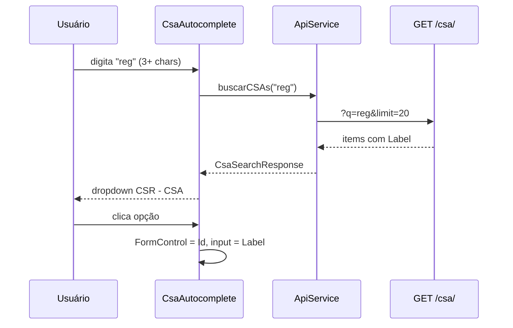

# Autocomplete de CSA com rótulo CSR — CSA

- **Data:** 2026-08-15
- **Status:** aceita
- **Contexto:** Após a importação BMLT ([20260815-importacao-bmlt-csr-csa.md](./20260815-importacao-bmlt-csr-csa.md)), o sistema passou a ter **~164 CSAs** distribuídos em **~14 CSRs**. O frontend carrega a lista inteira via `GET /csa/` e renderiza `<select>` nativos em três pontos (`onboarding` — filtro de encargos e modal de novo grupo; `grupo` — modal de cadastro/edição). Com 164 opções, o `<select>` fica impraticável (scroll longo, difícil localizar região/comunidade). Além disso, o usuário precisa distinguir CSAs homônimos ou parecidos pela **região (CSR)**, mas a API e a UI exibem apenas `csa.Nome`.

  **Requisito de produto:** substituir os selects de CSA por um campo de **autocomplete** que **só exibe sugestões após o usuário digitar no mínimo 3 caracteres**, com rótulo **`CSR - CSA`** (ex.: `Região X - Comunidade Y`).

  **Escopo imediato (solicitado):**
  1. Filtro de CSA na seção **“Adicionar encargos”** do onboarding.
  2. Campo CSA no modal **“Cadastrar novo grupo”** do onboarding.

- **Decisão:**

  1. **Substituir `<select>` de CSA por componente reutilizável** `CsaAutocompleteComponent` nos dois pontos do onboarding (escopo v1). O modal de `grupo.component` deve migrar na mesma entrega por consistência (mesmo componente, esforço marginal).
  2. **Busca server-side** em `GET /api/csa/` — **não** carregar nem filtrar 164 registros no frontend.
  3. **Parâmetro `q`** (obrigatório para listagem): mínimo **3 caracteres**; busca case-insensitive em `csr."Nome"` **ou** `csa."Nome"` (`ILIKE '%q%'`); retorno limitado (padrão **20**, máx. **50** via `limit`).
  4. **Parâmetro `id`** (opcional): retorna **um** CSA pelo `"Id"` interno, com `CSR_Nome`, para exibir o rótulo quando o formulário já tem valor (edição ou pré-preenchimento a partir do filtro).
  5. **Formato de exibição:** propriedade calculada **`Label`** = `CSR_Nome + ' - ' + Nome`. Se `CSR` for `NULL` (registro legado seed), usar só `Nome` (fallback documentado).
  6. **Descontinuar listagem completa** sem parâmetros: `GET /csa/` sem `q` nem `id` responde **400** com mensagem orientando o uso de busca — evita regressão silenciosa e payload desnecessário.
  7. **Contrato de resposta da busca:**

     ```json
     {
       "items": [
         {
           "Id": 42,
           "Nome": "Comunidade Y",
           "CSR": 3,
           "CSR_Nome": "Região X",
           "Label": "Região X - Comunidade Y"
         }
       ],
       "total": 1,
       "limit": 20
     }
     ```

  8. **UX do componente:** input de texto livre; dropdown vazio/instrução enquanto `length < 3`; debounce **300 ms**; loading indicator; seleção grava **`Id`** no `FormControl`; exibe **`Label`** no input após seleção; botão “limpar” restaura estado vazio (filtro de encargos = “nenhuma CSA selecionada”, equivalente ao antigo “Todas as CSAs”).

- **Alternativas consideradas:**

  | Alternativa | Prós | Contras | Veredito |
  |-------------|------|---------|----------|
  | Filtrar no frontend após `GET /csa/` completo | Sem mudança na API | 164+ objetos em toda tela; sem busca por CSR; viola requisito de não listar antes de digitar | **Rejeitada** |
  | `<select>` agrupado por `<optgroup>` (CSR) | Nativo, simples | Ainda 164 opções visíveis; scroll longo; não exige 3 caracteres | **Rejeitada** |
  | Endpoint novo `/csa/busca/` | Separação clara | Duplica recurso; projeto usa um `index.php` por entidade | **Rejeitada** — estender `GET /csa/` |
  | Angular Material `mat-autocomplete` | Componente pronto | Nova dependência (~500 KB+); projeto usa Tailwind + forms nativos | **Rejeitada** na v1 |
  | Manter `GET /csa/` listando tudo para compatibilidade | Zero breaking change | Frontend continuaria tentando carregar tudo; outros clientes idem | **Rejeitada** — breaking controlado com 400 |

- **Impacto:**
  - **banco:** nenhuma migração — usar `JOIN csr` e índices `csa_nome_idx` / `csr_nome_idx` já previstos em [20260815_csr_csa_bmlt.sql](../../database/20260815_csr_csa_bmlt.sql).
  - **api:** alterar [api/csa/index.php](../../api/csa/index.php) — ramificações `id`, `q`, validação de comprimento, `Label` no JSON.
  - **frontend:** novo `CsaAutocompleteComponent`; modelo `CsaOption`; `ApiService.buscarCSAs()` / `getCSA(id)`; remover `getCSAs()` ou redirecioná-lo; refatorar [onboarding.component](../../frontend/src/app/onboarding/onboarding.component.ts) e [grupo.component](../../frontend/src/app/components/grupo/grupo.component.ts).
  - **operação:** nenhuma variável de ambiente nova.

- **Riscos e mitigação:**

  | Risco | Mitigação |
  |-------|-----------|
  | CSA legado sem `CSR` | `Label` = `Nome`; documentar no componente |
  | Usuário não encontra CSA com termo curto (< 3) | Texto de ajuda: “Digite pelo menos 3 letras do nome da região ou da comunidade” |
  | Muitos resultados para termos genéricos (“são”) | `LIMIT 20` + ordenação `CSR_Nome, Nome`; usuário refina busca |
  | Valor selecionado perdido ao reabrir modal | `GET /csa/?id=` hidrata `Label` no `writeValue` do CVA |
  | Breaking change em `GET /csa/` sem params | Único consumidor é o frontend deste repo; ajuste simultâneo na mesma entrega |

- **Próximos passos:**

  ### dev-php
  1. Refatorar `GET` em `api/csa/index.php`:
     - `?id={int}` → um registro com `LEFT JOIN csr`, campos `CSR_Nome`, `Label`.
     - `?q={string}&limit={int}` → validar `strlen(trim(q)) >= 3`; senão **400** `{ "message": "Informe ao menos 3 caracteres para buscar CSAs." }`.
     - SQL sugerido (busca):

       ```sql
       SELECT c."Id", c."Nome", c."CSR",
              r."Nome" AS "CSR_Nome",
              CASE
                WHEN r."Nome" IS NOT NULL THEN r."Nome" || ' - ' || c."Nome"
                ELSE c."Nome"
              END AS "Label"
       FROM csa c
       LEFT JOIN csr r ON r."Id" = c."CSR"
       WHERE LOWER(c."Nome") LIKE LOWER(:q)
          OR LOWER(r."Nome") LIKE LOWER(:q)
       ORDER BY r."Nome" NULLS LAST, c."Nome"
       LIMIT :limit
       ```

     - Contagem opcional em subquery ou `COUNT(*) OVER()` para `total`.
  2. Sem `id` nem `q` → **400** (não retornar lista completa).
  3. Atualizar [.cursor/docs/api.md](../../.cursor/docs/api.md) (contrato `GET /csa/`).

  ### frontend-dev
  1. Criar `frontend/src/app/models/csa.model.ts`:

     ```typescript
     export interface CsaOption {
       Id: number;
       Nome: string;
       CSR: number | null;
       CSR_Nome: string | null;
       Label: string;
     }

     export interface CsaSearchResponse {
       items: CsaOption[];
       total: number;
       limit: number;
     }
     ```

  2. Criar **`CsaAutocompleteComponent`** (`frontend/src/app/components/csa-autocomplete/`):
     - Standalone; implementa **`ControlValueAccessor`** + **`Validator`** (opcional `required`).
     - `@Input() placeholder`, `@Input() inputId`, `@Input() required`.
     - `@Output() selectionChange` (opcional, para sincronizar filtro → modal).
     - Lógica: `valueChanges` com `debounceTime(300)`, `distinctUntilChanged`, `switchMap` → `api.buscarCSAs(q)`; só dispara se `q.length >= 3`.
     - Template: `<input type="search">` + lista `<ul>` posicionada (Tailwind, padrão visual do onboarding); estados: hint, loading, vazio, resultados.
     - Ao selecionar item: `onChange(item.Id)`, exibir `item.Label`, fechar lista.
     - `writeValue(id)`: se `id > 0`, chamar `getCSA(id)` para preencher label.
  3. **`ApiService`:** substituir `getCSAs()` por:
     - `buscarCSAs(q: string, limit = 20): Observable<CsaSearchResponse>`
     - `getCSA(id: number): Observable<CsaOption>`
  4. **Onboarding:**
     - `filterForm.csa`: trocar `<select>` por `<app-csa-autocomplete formControlName="csa">`.
     - `novoGrupoForm.csa`: idem no modal.
     - Remover `csas[]`, `isLoadingCsas`, chamada inicial a `getCSAs()`.
     - Manter regra: `csa <= 0` no filtro = não filtra por CSA (usuário ainda precisa CSA **ou** busca por nome de grupo).
     - Ao abrir modal “Novo grupo”, se filtro já tem CSA selecionada, pré-preencher via `writeValue` (comportamento atual preservado).
  5. **Grupo (consistência):** trocar `<select>` do modal por `CsaAutocompleteComponent`; hidratar ao editar com `grupo.CSA`.
  6. Estilos alinhados a `.form-group` / onboarding existente.

- **Fora de escopo (v1):**
  - Autocomplete de **grupo** (já existe campo de busca por nome separado no onboarding).
  - CRUD de CSR/CSA.
  - Agrupamento visual por CSR no dropdown (lista flat com `Label` suficiente).
  - Paginação/infinite scroll na lista de sugestões (limit 20).
  - Teclado avançado (setas/Enter) — desejável v2, não bloqueante.

---

## Estado atual (referência)

| Local | Arquivo | Comportamento hoje |
|-------|---------|-------------------|
| Filtro encargos | `onboarding.component.html` L62–65 | `<select>` + `getCSAs()` no init |
| Novo grupo (modal) | `onboarding.component.html` L181–184 | `<select>` mesma lista |
| Grupo CRUD (modal) | `grupo.component.html` L56–59 | `<select>` mesma lista |

API: [api/csa/index.php](../../api/csa/index.php) — `SELECT * FROM csa ORDER BY "Nome"` (sem CSR, sem busca).

Não existe componente de autocomplete no frontend (sem Angular Material/CDK).

---

## Contrato API proposto

### `GET /api/csa/?q={texto}&limit={n}`

| Parâmetro | Obrigatório | Regra |
|-----------|-------------|-------|
| `q` | Sim* | Trim; length ≥ 3 |
| `limit` | Não | Default 20; max 50 |
| `id` | Sim* | Alternativa a `q`; retorna 1 item ou 404 |

\* Exatamente um modo: **`q`** (busca) **ou** **`id`** (detalhe).

**Respostas:**
- **200** — `{ items, total, limit }` (busca) ou objeto único / `{ items: [one] }` (detalhe — alinhar ao padrão de busca com `items[0]` para simplificar frontend).
- **400** — `q` ausente/curto ou request sem `q`/`id`.
- **404** — `id` inexistente.

**Recomendação:** detalhe por `id` retorna **mesmo shape** `{ items: [CsaOption], total: 1, limit: 1 }` para um único parser no Angular.

### Exemplo

```
GET /api/csa/?q=abc&limit=20
```

```json
{
  "items": [
    {
      "Id": 117,
      "Nome": "CSA ABC Paulista",
      "CSR": 5,
      "CSR_Nome": "Região ABC",
      "Label": "Região ABC - CSA ABC Paulista"
    }
  ],
  "total": 1,
  "limit": 20
}
```

---

## Componente Angular proposto

```
frontend/src/app/components/csa-autocomplete/
  csa-autocomplete.component.ts
  csa-autocomplete.component.html
  csa-autocomplete.component.css
```

**Selector:** `app-csa-autocomplete`

**Uso (Reactive Forms):**

```html
<app-csa-autocomplete
  formControlName="csa"
  inputId="filtro-csa"
  placeholder="Digite região ou comunidade..."
></app-csa-autocomplete>
```

**Valor do controle:** `number` — `0` ou `null` = nenhuma CSA selecionada; `> 0` = `csa.Id`.

**Fluxo:**



---

## Telas afetadas

| Prioridade | Tela | Campo |
|------------|------|-------|
| P0 | Onboarding — Adicionar encargos | Filtro CSA |
| P0 | Onboarding — Modal novo grupo | CSA obrigatória |
| P1 | Grupos — Modal criar/editar | CSA obrigatória |

Display de **`CSA_Nome`** em grids (encargos ativos, lista de grupos) permanece como hoje; melhoria futura opcional: exibir `Label` completo também nessas colunas via join na API de grupos.
