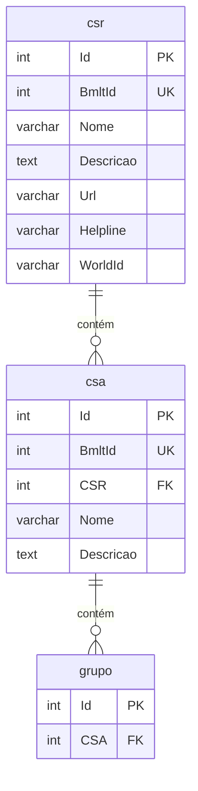

# Importação BMLT — hierarquia CSR e CSA

- **Data:** 2026-08-15
- **Status:** aceita
- **Contexto:** O Tesoureiro modela **CSAs** (Comunidade de Serviço de Área) como entidade de domínio: grupos pertencem a um CSA (`grupo."CSA"` → `csa."Id"`). Hoje `csa` tem apenas `Id` e `Nome`, com dados seed manuais. A ABNA publica a hierarquia oficial de estruturas de serviço no BMLT (`GetServiceBodies`), com **CSRs** (regiões, `type: "RS"`) e **CSAs** (`type: "AS"`) vinculados por `parent_id`. É necessário espelhar essa hierarquia no banco antes de importar grupos e demais dados do BMLT.

  **Fonte:** `https://bmlt.na.org.br/ativo/main_server/client_interface/json/?switcher=GetServiceBodies`  
  **Amostra (ago/2026):** 14 RS, 164 AS, 1 ZF (ABNA). Todo `AS` tem `parent_id` apontando para um `RS` existente.

- **Decisão:**

  1. **Nova tabela `csr`** para registros BMLT com `type = "RS"` (Regional Service / CSR).
  2. **Estender `csa`** com FK `CSR` → `csr."Id"`, preenchida na importação a partir do `parent_id` do JSON (que referencia o `BmltId` do CSR).
  3. **Coluna `BmltId`** (única quando preenchida) em `csr` e `csa` para idempotência da importação e correlação com o JSON, sem substituir o `Id` SERIAL interno usado por `grupo` e pela API.
  4. **Campos opcionais** `Descricao`, `Url`, `Helpline`, `WorldId` em ambas as tabelas, mapeados do JSON.
  5. **Não importar** registros `type = "ZF"` (ABNA) nesta etapa — servem apenas como raiz lógica no BMLT.
  6. **Migração SQL** em `database/20260815_csr_csa_bmlt.sql`; rotina de importação fica para etapa 2 (`dev-php`).

- **Alternativas consideradas:**

  | Alternativa | Prós | Contras | Veredito |
  |-------------|------|---------|----------|
  | Usar `BmltId` como PK de `csr`/`csa` | FK direta pelo `parent_id` do JSON | Quebra padrão SERIAL; IDs internos mudam; impacto em `grupo` | Rejeitada |
  | Tabela única `service_body` com `type` | Um único modelo | Mistura CSR e CSA; API e UI já falam em `csa` | Rejeitada |
  | Substituir tabela `csa` por importação completa | Dados sempre oficiais | Perde vínculos existentes de `grupo` sem remapeamento | Rejeitada na v1 — upsert por `BmltId` + match de legado |
  | Só `Nome` + `CSR`, sem metadados BMLT | Schema mínimo | Reimportação sem diff; perde `world_id` útil para cruzamento futuro | Rejeitada |

- **Impacto:**
  - **banco:** nova `csr`; colunas e FK em `csa`; índices em `BmltId` e `CSR`.
  - **api:** nenhuma mudança obrigatória na etapa 1 (`GET /csa/` continua funcionando). Etapa 2 pode expor `CSR_Nome` ou filtro por região.
  - **frontend:** nenhuma mudança na etapa 1. Dropdown de CSA pode ganhar agrupamento por CSR depois.
  - **operação:** aplicar migração antes da rotina de importação; acordo explícito do usuário para executar SQL.

- **Riscos e mitigação:**

  | Risco | Mitigação |
  |-------|-----------|
  | CSAs seed (`CSA ABC`, `CSA Mauá Sem Fronteiras`) sem `BmltId` | Colunas novas nullable; etapa 2 faz match por nome (`CSA ABC` ≈ `CSA ABC Paulista`, id BMLT 117) ou UPDATE manual |
  | `grupo."CSA"` aponta para IDs antigos após INSERT de novos CSAs | Preferir UPDATE dos registros existentes quando houver match; senão script de remapeamento |
  | BMLT altera nomes ou hierarquia | Upsert por `BmltId`; `AtualizadoEm` para auditoria |
  | AS com `parent_id` inválido | Na amostra atual não ocorre; importação valida FK antes do COMMIT |

- **Próximos passos:**
  - **dba:** script aplicado (`database/20260815_csr_csa_bmlt.sql`) — aguardar execução pelo usuário.
  - **dev-php (etapa 2):** endpoint ou script CLI que busca o JSON, upserta RS→`csr`, AS→`csa`, resolve `CSR` via `csr."BmltId" = parent_id`, trata legado seed.
  - **frontend-dev (futuro):** opcional agrupar CSAs por CSR no onboarding; fora do escopo da etapa 1.

- **Fora de escopo (etapa 1):**
  - Importação de grupos/reuniões do BMLT
  - Sincronização agendada (cron)
  - CRUD de CSR/CSA pela API
  - Importação do nó ZF (ABNA)

---

## Mapeamento JSON → tabelas

| Campo JSON | Tipo BMLT | Tabela.coluna | Observação |
|------------|-----------|---------------|------------|
| `id` | RS | `csr."BmltId"` | Chave externa BMLT |
| `name` | RS | `csr."Nome"` | |
| `description` | RS | `csr."Descricao"` | Pode ser vazio |
| `url` | RS | `csr."Url"` | |
| `helpline` | RS | `csr."Helpline"` | |
| `world_id` | RS | `csr."WorldId"` | Ex.: `RG089` |
| `id` | AS | `csa."BmltId"` | |
| `parent_id` | AS | `csa."CSR"` | Resolver: `csr."Id"` WHERE `csr."BmltId" = parent_id` |
| `name` | AS | `csa."Nome"` | |
| `description` | AS | `csa."Descricao"` | |
| `url` | AS | `csa."Url"` | |
| `helpline` | AS | `csa."Helpline"` | |
| `world_id` | AS | `csa."WorldId"` | Ex.: `AR24418` |
| — | — | `*.ImportadoEm` / `*.AtualizadoEm` | Preenchidos na rotina de importação |

Registros `type = "ZF"` e demais tipos: **ignorados** na v1.

### Hierarquia

