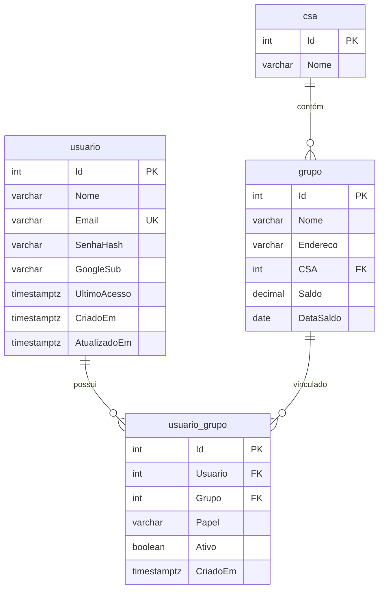

# Onboarding obrigatório — grupos e papéis por usuário

- **Data:** 2026-08-15
- **Status:** proposta
- **Contexto:** A autenticação (JWT, Google, e-mail/senha) já está implementada ([20260814-autenticacao-simples.md](./20260814-autenticacao-simples.md)), mas **não há vínculo** entre `usuario` e `grupo`. Hoje qualquer usuário autenticado acessa todos os grupos e todas as telas. O produto exige que, no **primeiro acesso** (e sempre que o usuário ainda não tiver vínculos), o usuário complete um fluxo de onboarding antes de usar tesouraria/reuniões/relatórios: selecionar um ou mais grupos, declarar o(s) **papel(es)** em cada grupo (`secretaria` e/ou `tesouraria` — o mesmo usuário pode assumir **ambos** no mesmo grupo) e, se necessário, **cadastrar um novo grupo** no mesmo fluxo. Sem isso, telas e endpoints que dependem de contexto de grupo não devem expor dados do domínio.

  **Regra de encargo único:** para cada combinação `grupo + papel`, só pode existir **um usuário ativo** com esse encargo. Ao solicitar um papel já ocupado, o sistema verifica o `UltimoAcesso` do usuário que o ocupa: se acesso nos últimos **20 dias** → bloqueio com mensagem informando o nome do usuário ativo; se **> 20 dias** (ou `UltimoAcesso` nulo) → inativa o vínculo antigo e ativa o do usuário atual.

- **Decisão:**

  1. **Nova tabela de associação** `usuario_grupo` ligando `usuario` ↔ `grupo` com coluna `Papel` (`secretaria` | `tesouraria`) e coluna `Ativo` (boolean).
  2. **Um encargo ativo por grupo+papel:** índice único parcial `("Grupo", "Papel") WHERE "Ativo" = true` — impede dois usuários ativos com o mesmo papel no mesmo grupo.
  3. **Múltiplos papéis por usuário no mesmo grupo:** `UNIQUE ("Usuario", "Grupo", "Papel")` — o usuário pode ter tesouraria **e** secretaria no mesmo grupo (duas linhas).
  4. **Coluna `UltimoAcesso`** em `usuario` — atualizada em login e `GET /me`; usada na regra dos 20 dias.
  5. **Onboarding completo** quando o usuário possui **≥ 1** vínculo **ativo** em `usuario_grupo` (derivado do banco; sem flag redundante em `usuario` na v1).
  3. **Novo endpoint** `POST /api/auth/onboarding` (transação) para gravar vínculos em lote e, opcionalmente, criar novos grupos no mesmo request.
  4. **Estender** `GET /api/auth/me` com `OnboardingCompleto` e lista `Grupos` (vínculos do usuário).
  5. **API:** middleware `requireOnboardingComplete()` em `reuniao`, `despesas` e `relatorios`; em `grupo`, permitir `GET` (lista para seleção) e `POST` (criação no onboarding) mesmo sem onboarding, bloquear `PUT`/`DELETE` até completo.
  6. **Frontend:** rota `/onboarding`, `onboardingGuard` nas rotas `/app/*`, redirecionamento após login/cadastro conforme estado; **não** chamar serviços de reunião/relatório/despesa até onboarding completo.
  7. **Papéis v1:** armazenados e exibidos; **não** restringem operações na API (RBAC por papel fica para ADR futura).

- **Alternativas consideradas:**

  | Alternativa | Prós | Contras | Veredito |
  |-------------|------|---------|----------|
  | Coluna `OnboardingCompleto` em `usuario` | Consulta rápida | Pode divergir de `usuario_grupo`; exige sincronização | Rejeitada na v1 — derivar de COUNT |
  | Flag no JWT (`onboarding: true`) | Evita `/me` extra | Token desatualiza após onboarding até expirar | Rejeitada — estado no `/me` e cache no `AuthService` |
  | Só guard no Angular (sem 403 na API) | Implementação rápida | API expõe dados com Bearer válido | Rejeitada — bloqueio em ambas as camadas |
  | Endpoint `api/usuario/grupos/` separado | REST “puro” | Mais recurso para fluxo único de onboarding | Adiada — `auth/onboarding` na v1 |
  | Papel global no `usuario` (um papel para todos os grupos) | Modelo simples | Não atende requisito de papel diferente por grupo | Rejeitada |
  | `ENUM` PostgreSQL para `Papel` | Tipo forte | Migração mais rígida para novos papéis | Rejeitada — `VARCHAR` + `CHECK` (padrão do projeto) |
  | Um papel por usuário+grupo (`UNIQUE (Usuario, Grupo)`) | Modelo simples | Não permite tesouraria e secretaria no mesmo grupo | Rejeitada |
  | Transferência automática sem checar último acesso | Fluxo sempre permitido | Remove controle de encargo ocupado recentemente | Rejeitada — regra dos 20 dias |

- **Impacto:**
  - **banco:** tabela `usuario_grupo` com `Ativo`; índices `UNIQUE (Usuario, Grupo, Papel)` e parcial `(Grupo, Papel) WHERE Ativo`; coluna `UltimoAcesso` em `usuario`; opcional índice único `grupo` `(CSA, LOWER(Nome))` para duplicata.
  - **api:** `auth/index.php` (`me`, `onboarding`); `config/auth.php` (`requireOnboardingComplete`, helpers); ajustes em `grupo`, `reuniao`, `despesas`, `relatorios`.
  - **frontend:** rota `/onboarding`, componente wizard, guards, extensão `AuthService`/`Usuario`, redirect login → onboarding ou app.
  - **operação:** sem novas variáveis de ambiente.

- **Riscos e mitigação:**

  | Risco | Mitigação |
  |-------|-----------|
  | `GET /grupo` lista todos os grupos antes do onboarding | Aceito v1 — necessário para seleção; RBAC futuro limitará visibilidade |
  | Usuário cria grupo duplicado no onboarding | Validação `LOWER(Nome)` + mesmo `CSA` → 409 |
  | Encargo já ocupado por usuário ativo recente | 409 `encargo_preenchido` com nome do usuário; UI exibe alerta |
  | `UltimoAcesso` desatualizado | Atualizar em login e `/me`; documentar |
  | Token antigo após completar onboarding | `carregarUsuarioAtual()` no guard; 403 na API força refresh de estado |
  | Papéis sem efeito na API | Documentar; UI pode adaptar labels/menus depois |

- **Próximos passos:** ver [onboarding-plano-implementacao.md](../onboarding-plano-implementacao.md).

- **Fora de escopo (v1):**
  - Editar/remover vínculos após onboarding (telas de “meus grupos”)
  - RBAC: secretaria vs tesouraria restringindo endpoints
  - Convite por e-mail ou aprovação de vínculo por admin
  - Grupo “pendente” / workflow de aprovação
  - Re-onboarding obrigatório se admin remove todos os vínculos (tratar como edge case manual)

---

## Modelo de dados

### Diagrama ER (extensão)



### Tabela `usuario_grupo` (nova)

| Coluna | Tipo | Obrigatório | Descrição |
|--------|------|-------------|-----------|
| `"Id"` | SERIAL PK | sim | Identificador |
| `"Usuario"` | INTEGER FK → `usuario."Id"` | sim | Usuário autenticado |
| `"Grupo"` | INTEGER FK → `grupo."Id"` | sim | Grupo selecionado |
| `"Papel"` | VARCHAR(20) | sim | `secretaria` ou `tesouraria` |
| `"Ativo"` | BOOLEAN | sim | Default `true`; encargo vigente |
| `"CriadoEm"` | TIMESTAMPTZ | sim | Default `NOW()` |

**Constraints:**

```sql
-- Esboço para o agent dba (não executar daqui)
UNIQUE ("Usuario", "Grupo", "Papel")
CHECK ("Papel" IN ('secretaria', 'tesouraria'))
FOREIGN KEY ("Usuario") REFERENCES usuario ("Id") ON DELETE CASCADE
FOREIGN KEY ("Grupo") REFERENCES grupo ("Id") ON DELETE RESTRICT
```

**Índices sugeridos:**

- `usuario_grupo_usuario_idx` em `("Usuario")` — listar vínculos no `/me`
- `usuario_grupo_grupo_idx` em `("Grupo")` — uso futuro (RBAC)
- `usuario_grupo_grupo_papel_ativo_idx` **UNIQUE** em `("Grupo", "Papel") WHERE `"Ativo" = true` — um encargo ativo por grupo+papel no sistema

### Coluna `UltimoAcesso` em `usuario` (nova)

| Coluna | Tipo | Obrigatório | Descrição |
|--------|------|-------------|-----------|
| `"UltimoAcesso"` | TIMESTAMPTZ | não | Último login ou chamada autenticada a `/me`; usado na regra dos 20 dias |

Atualizada em: `POST /auth/login`, `POST /auth/google`, `GET /auth/me` (e opcionalmente logout não altera).

### Duplicata de nome de grupo (opcional mas recomendado)

Hoje `grupo."Nome"` não é único. Para o fluxo “cadastrar novo grupo”:

- **Regra:** não permitir dois grupos com o mesmo nome (**case-insensitive**) na **mesma CSA**.
- **Implementação:** índice único parcial ou composto:

```sql
CREATE UNIQUE INDEX grupo_csa_nome_lower_idx ON grupo ("CSA", LOWER("Nome"));
```

Conflito → HTTP **409** `{ "message": "Já existe um grupo com este nome nesta CSA" }`.

### Derivação de `OnboardingCompleto`

```text
OnboardingCompleto = EXISTS (
  SELECT 1 FROM usuario_grupo ug
  WHERE ug."Usuario" = usuario.Id AND ug."Ativo" = true
)
```

Não há estado intermediário persistido: o usuário envia o lote completo no `POST /auth/onboarding`. Reenvio com novos vínculos **adiciona** ou **reativa** — não substitui o conjunto inteiro na v1.

### Regra de encargo único (grupo + papel)

Para cada item do request com `GrupoId` + `Papel`:

```text
1. Buscar usuario_grupo ATIVO de OUTRO usuário com mesmo Grupo + Papel
2. Se não existe → INSERT ou reativar vínculo do usuário atual
3. Se existe (usuário B):
   a. dias = NOW() - usuario_B.UltimoAcesso (NULL conta como > 20 dias)
   b. Se dias < 20 → 409 encargo_preenchido (não altera banco)
   c. Se dias >= 20 → UPDATE vínculo de B: Ativo=false;
                      INSERT ou UPDATE vínculo do usuário atual: Ativo=true
```

Mensagem de bloqueio (409):

```text
O encargo solicitado encontra-se preenchido pelo usuário ativo '{Nome de B}'
```

O mesmo usuário solicitando tesouraria **e** secretaria no mesmo grupo gera **duas linhas** em `usuario_grupo`; a validação de encargo roda **independente** para cada papel.

---

## Fluxo de onboarding

### Diagrama de navegação (frontend)

```mermaid
flowchart TD
    Login[/login ou /cadastro]
    Me[GET /auth/me]
  Onb[/onboarding]
    App[/app/grupos ...]

    Login -->|JWT| Me
    Me -->|OnboardingCompleto false| Onb
    Me -->|OnboardingCompleto true| App
    Onb -->|POST /auth/onboarding 201| App
    App -->|guard: onboarding incompleto| Onb
```

### Wizard (3 passos sugeridos na UI)

| Passo | Conteúdo | Validação cliente |
|-------|----------|-------------------|
| 1 — Boas-vindas | Texto: “Antes de continuar, informe em quais grupos você atua.” | — |
| 2 — Seleção | Lista `GET /grupo` (checkboxes) + busca local por nome | ≥ 1 grupo selecionado **ou** ≥ 1 novo grupo no passo 3 |
| 3 — Papéis e novos grupos | Para cada grupo selecionado: **checkboxes** `secretaria` e `tesouraria` (ambos permitidos). Botão “Cadastrar novo grupo” (modal): Nome, Endereco, CSA (`GET /csa`), checkboxes de papel. | ≥ 1 papel marcado em cada grupo (existente ou novo) |

**Redirecionamento após login/cadastro:** não ir direto a `/app/grupos`; chamar `carregarUsuarioAtual()` e:

- `OnboardingCompleto === false` → `/onboarding`
- `OnboardingCompleto === true` → `/app/grupos`

### Sequência API (onboarding)

```mermaid
sequenceDiagram
    participant FE as Angular /onboarding
    participant API as POST /api/auth/onboarding
    participant DB as PostgreSQL

    FE->>API: { Vinculos, NovosGrupos? }
    API->>API: requireAuth()
    API->>API: Validar Papel, IDs, campos de novo grupo
    API->>DB: BEGIN
    loop NovosGrupos
        API->>DB: INSERT grupo (se CSA+Nome único)
    end
    loop Vinculos
        API->>DB: Verificar encargo ativo (regra 20 dias)
        alt ocupado < 20 dias
            API-->>FE: 409 encargo_preenchido
        else livre ou >= 20 dias
            API->>DB: Inativar antigo se necessário; INSERT/UPDATE usuario_grupo
        end
    end
    API->>DB: COMMIT
    API-->>FE: 201 { OnboardingCompleto true, Grupos }
    FE->>FE: Atualizar AuthService, navigate /app/grupos
```

---

## Regras de negócio

### Quando o onboarding é considerado completo

1. Existe **pelo menos um** registro **ativo** em `usuario_grupo` para o `usuario.Id` autenticado.
2. Todos os registros têm `Papel` ∈ `{ secretaria, tesouraria }` (garantido por CHECK).
3. Após `POST /auth/onboarding` bem-sucedido, `GET /auth/me` retorna `OnboardingCompleto: true`.

### Regra dos 20 dias (encargo ocupado)

| Condição | Ação |
|----------|------|
| Nenhum outro usuário ativo com mesmo `Grupo` + `Papel` | Criar ou reativar vínculo do usuário atual |
| Outro usuário ativo; `UltimoAcesso` **&lt; 20 dias** | **409** — mensagem com nome do usuário ativo; UI exibe **alerta** |
| Outro usuário ativo; `UltimoAcesso` **≥ 20 dias** ou `NULL` | `Ativo = false` no vínculo antigo; ativar vínculo do usuário atual |

Cálculo: `NOW() - "UltimoAcesso" < interval '20 days'` → bloqueio. Front-end não decide sozinho; confia na API.

### Validações `POST /auth/onboarding`

**Body JSON:**

```json
{
  "Vinculos": [
    { "GrupoId": 1, "Papel": "tesouraria" },
    { "GrupoId": 1, "Papel": "secretaria" },
    { "GrupoId": 2, "Papel": "secretaria" }
  ],
  "NovosGrupos": [
    {
      "Nome": "Grupo Novo",
      "Endereco": "Rua Exemplo, 100",
      "CSA": 1,
      "Papeis": ["tesouraria", "secretaria"]
    }
  ]
}
```

`NovosGrupos` aceita `Papeis` (array) **ou** `Papel` (string) para um único papel — preferir `Papeis` na UI.

| Regra | Erro |
|-------|------|
| `Vinculos` e `NovosGrupos` não podem ser ambos vazios | 400 |
| `Papel` obrigatório em cada item de `Vinculos` | 400 |
| `Papel` só `secretaria` ou `tesouraria` | 400 |
| `GrupoId` deve existir em `grupo` | 400 |
| Duplicata `(Usuario, Grupo, Papel)` no mesmo request | 400 |
| `NovosGrupos`: `Nome`, `Endereco`, `CSA` obrigatórios; ≥ 1 papel | 400 |
| `CSA` deve existir | 400 |
| Nome duplicado na CSA | 409 `grupo_duplicado` |
| Encargo ativo ocupado (&lt; 20 dias) | 409 `encargo_preenchido` |
| Usuário já com onboarding completo reenvia só vínculos novos | 201 (adiciona/reativa); não remove existentes |

**Saldo / DataSaldo** em novos grupos: `Saldo = 0`, `DataSaldo = NULL` (igual `grupo/index.php` hoje).

### Quem pode criar grupo no fluxo

- Qualquer usuário **autenticado** durante onboarding (e, após v1, o mesmo `POST /grupo` continua disponível para usuários com onboarding completo na aba Grupos).
- Não há role “admin” na v1.

### Papéis (v1)

| Papel | Uso v1 |
|-------|--------|
| `secretaria` | Armazenado e retornado no `/me`; UI pode exibir badge |
| `tesouraria` | Idem |

**Sem restrição de API** por papel nesta entrega.

---

## Contratos API

### `GET /api/auth/me` (alterado)

Resposta **200:**

```json
{
  "Id": 1,
  "Nome": "Maria",
  "Email": "maria@example.com",
  "OnboardingCompleto": false,
  "Grupos": [
    {
      "GrupoId": 1,
      "Nome": "Grupo Parque Erasmo",
      "CSA": 1,
      "CSA_Nome": "CSA ABC",
      "Papel": "tesouraria",
      "Ativo": true
    },
    {
      "GrupoId": 1,
      "Nome": "Grupo Parque Erasmo",
      "CSA": 1,
      "CSA_Nome": "CSA ABC",
      "Papel": "secretaria",
      "Ativo": true
    }
  ]
}
```

- `Grupos`: apenas vínculos **ativos**; vazia se onboarding incompleto.
- `OnboardingCompleto`: calculado no backend (nunca confiar só no cliente).

### `POST /api/auth/onboarding` (novo)

- **Auth:** Bearer obrigatório.
- **Resposta 201:** `{ "message", "OnboardingCompleto": true, "Grupos": [...] }` (mesma estrutura de vínculos).
- **403:** não usado na v1 (sempre permite completar/adicionar).
- **409 `grupo_duplicado`:** nome de grupo duplicado na CSA.
- **409 `encargo_preenchido`:**

```json
{
  "message": "O encargo solicitado encontra-se preenchido pelo usuário ativo 'Maria Silva'",
  "error": "encargo_preenchido",
  "GrupoId": 1,
  "Papel": "tesouraria",
  "UsuarioAtivo": { "Id": 2, "Nome": "Maria Silva" }
}
```

Se **um** vínculo do lote falha por encargo, a transação **reverte** o lote inteiro (atomicidade).

### Endpoints existentes — matriz de bloqueio

| Recurso | Sem onboarding | Com onboarding |
|---------|----------------|----------------|
| `auth/me`, `auth/logout` | ✅ | ✅ |
| `auth/onboarding` | ✅ POST | ✅ POST (adicionar vínculos) |
| `csa` GET | ✅ | ✅ |
| `grupo` GET | ✅ (lista para seleção) | ✅ |
| `grupo` POST | ✅ (criar no fluxo) | ✅ |
| `grupo` PUT/DELETE | ❌ 403 `onboarding_required` | ✅ |
| `reuniao` * | ❌ 403 | ✅ |
| `despesas` * | ❌ 403 | ✅ |
| `relatorios` * | ❌ 403 | ✅ |

**Corpo 403 padronizado:**

```json
{
  "message": "Complete o cadastro de grupos antes de continuar",
  "error": "onboarding_required"
}
```

Implementação PHP sugerida em `config/auth.php`:

```php
function usuarioTemOnboardingCompleto($conn, $usuarioId) { ... }
function requireOnboardingComplete($conn, $usuarioId) { ... }
function atualizarUltimoAcesso($conn, $usuarioId) { ... }
function resolverEncargoGrupo($conn, $usuarioId, $grupoId, $papel) { ... }
```

Chamada após `requireAuth()` nos recursos bloqueados.

---

## Frontend — guards e bloqueio de telas

### Novos guards

| Guard | Rotas | Lógica |
|-------|-------|--------|
| `onboardingCompleteGuard` | `/app/*` | Autenticado **e** `OnboardingCompleto`; senão → `/onboarding` |
| `onboardingIncompleteGuard` | `/onboarding` | Autenticado **e** **não** completo; se completo → `/app/grupos` |

`authGuard` permanece na árvore `/app`; adicionar `onboardingCompleteGuard` nos children.

### Rotas (`app.routes.ts`)

```text
/onboarding     → OnboardingComponent, canActivate: [authGuard, onboardingIncompleteGuard]
/app/*          → canActivate: [authGuard, onboardingCompleteGuard] (nos children ou parent)
```

### `AuthService`

- Estender `Usuario` com `OnboardingCompleto` e `Grupos`.
- Após login/cadastro: `carregarUsuarioAtual()` antes de navegar.
- Método `isOnboardingComplete(): boolean` (lê estado atual).
- `persistUsuario` atualiza após `/me` e resposta do onboarding.

### Interceptor (`auth.interceptor.ts`)

- Em resposta **403** com `error === 'onboarding_required'`: atualizar usuário (`carregarUsuarioAtual` ou set `OnboardingCompleto = false`) e `navigate(['/onboarding'])`.
- Não fazer logout (diferente de 401).

### Componentes de domínio

- `GrupoComponent`, `ReuniaoComponent`, `RelatoriosComponent`: **não** alterar lógica interna na v1 se os guards impedem entrada; opcional `ngOnInit` guard clause se rota acessada sem guard.
- **Onboarding:** não usar `ApiService` de reuniões/relatórios; só `GET grupo`, `GET csa`, `POST auth/onboarding`.
- Em **409 `encargo_preenchido`:** exibir alerta com `message` da API; desmarcar o checkbox do papel bloqueado ou manter estado até o usuário ajustar a seleção.

### Shell (`AppShellComponent`)

- Abas Grupos / Reuniões / Relatórios só renderizam sob `/app/*` com onboarding completo.
- Cabeçalho “Bem-vindo” pode mostrar resumo: “3 grupos” link futuro.

---

## Documento detalhado

Plano acionável para agents: [onboarding-plano-implementacao.md](../onboarding-plano-implementacao.md)
