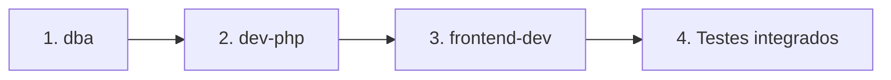

# Plano de implementação — Onboarding obrigatório (grupos e papéis)

Documento acionável para os agents `dba`, `dev-php` e `frontend-dev`.  
Decisão registrada em [decisoes/20260815-onboarding-grupos-papeis.md](./decisoes/20260815-onboarding-grupos-papeis.md).

---

## 1. Visão geral

Após autenticar (Google ou e-mail/senha), o usuário **não** acessa tesouraria até completar o onboarding: escolher grupo(s), marcar papel(es) (`secretaria` e/ou `tesouraria` — **ambos no mesmo grupo permitidos**) e, se preciso, cadastrar novo grupo. O estado é persistido em `usuario_grupo` (com `Ativo`); a API valida **encargo único** por grupo+papel com regra dos **20 dias** de `UltimoAcesso`. API e Angular bloqueiam recursos de domínio até haver ≥ 1 vínculo ativo.

```mermaid
flowchart TB
    subgraph publico [Público]
        Login[/login]
        Cadastro[/cadastro]
    end

    subgraph onboarding [Onboarding]
        Onb[/onboarding]
    end

    subgraph app [App autenticada]
        AppShell[/app]
        Grupos[grupos]
        Reunioes[reuniões]
        Relatorios[relatórios]
    end

    subgraph api [API PHP]
        AuthEP[auth/me onboarding]
        GrupoEP[grupo GET POST]
        Bloqueados[reuniao despesas relatorios]
    end

  subgraph dados [PostgreSQL]
        Usuario[(usuario)]
        UsuarioGrupo[(usuario_grupo)]
        Grupo[(grupo)]
    end

    Login --> AuthEP
    Cadastro --> AuthEP
    AuthEP --> Usuario
    Onb --> AuthEP
    Onb --> GrupoEP
    Onb -->|POST onboarding| UsuarioGrupo
    App --> Bloqueados
    Bloqueados --> UsuarioGrupo
    UsuarioGrupo --> Grupo
```

### Alinhamento com o codebase

| Aspecto | Padrão existente | Como onboarding se encaixa |
|---------|------------------|----------------------------|
| API | `api/{recurso}/index.php`, `switch` por método | `POST /auth/onboarding` em `api/auth/index.php` |
| Banco | Tabelas minúsculas, colunas PascalCase | `usuario_grupo` com `"Usuario"`, `"Grupo"`, `"Papel"`, `"Ativo"`; `usuario."UltimoAcesso"` |
| Auth | `requireAuth()` em `config/auth.php` | Novo `requireOnboardingComplete()` |
| Frontend | Guards funcionais, `AuthService` | `onboardingCompleteGuard`, rota `/onboarding` |
| Grupo POST | `Nome`, `Endereco`, `CSA` obrigatórios | Mesma validação em novos grupos do onboarding |

---

## 2. Ordem de implementação



**Dependência:** migração SQL aplicada manualmente pelo usuário antes de testar API.

---

## 3. Fase 1 — `dba`

### 3.1 Arquivos

| Arquivo | Ação |
|---------|------|
| `database/20260815_usuario_grupo_onboarding.sql` | Criar |
| `database/20260815_usuario_grupo_onboarding_rollback.sql` | Criar |

### 3.2 Conteúdo da migração

1. `ALTER TABLE usuario ADD COLUMN "UltimoAcesso" TIMESTAMPTZ` (nullable).
2. `CREATE TABLE usuario_grupo` com FKs, `CHECK` de papel, `UNIQUE ("Usuario", "Grupo", "Papel")`, coluna `"Ativo" BOOLEAN NOT NULL DEFAULT true`.
3. Índices em `("Usuario")` e `("Grupo")`.
4. **Obrigatório:** `CREATE UNIQUE INDEX usuario_grupo_grupo_papel_ativo_idx ON usuario_grupo ("Grupo", "Papel") WHERE "Ativo" = true`.
5. **Recomendado:** `CREATE UNIQUE INDEX grupo_csa_nome_lower_idx ON grupo ("CSA", LOWER("Nome"))`.
6. Comentários `COMMENT ON` (padrão `20260814_usuario_auth.sql`).
7. Script de rollback: drop índices e tabela; drop coluna `UltimoAcesso`.

### 3.3 Não fazer

- Não alterar `docker/postgres/init/01-schema.sql` (migração incremental).
- Não executar no banco (regra do agent).

### 3.4 Critério de aceite

- [ ] Script aplicável sem erro em PostgreSQL 16 vazio + schema existente.
- [ ] Rollback documentado e testável pelo usuário.

---

## 4. Fase 2 — `dev-php`

### 4.1 `api/config/auth.php`

Adicionar:

```php
function usuarioTemOnboardingCompleto(PDO $conn, int $usuarioId): bool
function requireOnboardingComplete(PDO $conn, int $usuarioId): void
function listarGruposUsuario(PDO $conn, int $usuarioId): array  // só Ativo=true
function validarPapel(string $papel): ?string
function atualizarUltimoAcesso(PDO $conn, int $usuarioId): void
function resolverEncargoGrupo(PDO $conn, int $usuarioId, int $grupoId, string $papel): void
// resolverEncargoGrupo: checa ocupação, regra 20 dias; lança EncargoPreenchidoException ou grava
```

- `requireOnboardingComplete`: se falso → `http_response_code(403)` + JSON `onboarding_required` + `exit`.
- `listarGruposUsuario`: JOIN `usuario_grupo` + `grupo` + `csa` WHERE `ug."Ativo" = true` → array para `/me`.
- `atualizarUltimoAcesso`: `UPDATE usuario SET "UltimoAcesso" = NOW()` — chamar em login, google e `/me`.

### 4.2 `api/auth/index.php`

#### `GET /auth/me`

- Após `requireAuth()`, chamar `atualizarUltimoAcesso()`.
- Buscar usuário e vínculos ativos.
- Retorno de `usuarioPublico()` estendido:

```php
[
  'Id' => ...,
  'Nome' => ...,
  'Email' => ...,
  'OnboardingCompleto' => usuarioTemOnboardingCompleto(...),
  'Grupos' => listarGruposUsuario(...),
]
```

#### `POST /auth/onboarding`

- `requireAuth()`; ler JSON `Vinculos` + `NovosGrupos` (arrays, default `[]`).
- Validar conforme ADR (incl. duplicatas no request por `(Usuario, Grupo, Papel)`).
- Transação PDO:
  1. Para cada `NovosGrupos`: INSERT `grupo` (tratar 23505 → 409 `grupo_duplicado`).
  2. Para cada papel em novo grupo (`Papeis` array ou `Papel` string): `resolverEncargoGrupo()`.
  3. Para cada `Vinculos`: `resolverEncargoGrupo()`.
- Em `EncargoPreenchidoException`: rollback + 409 `encargo_preenchido` com `UsuarioAtivo`.
- `201` com `OnboardingCompleto` e `Grupos` atualizados.

#### `POST /auth/login` e `POST /auth/google`

- Após autenticar com sucesso: `atualizarUltimoAcesso()`.

Funções auxiliares locais ou em `auth.php` se reutilizáveis.

### 4.3 `api/grupo/index.php`

Após `requireAuth()`:

| Método | Onboarding incompleto |
|--------|------------------------|
| GET | Permitir |
| POST | Permitir |
| PUT, DELETE | `requireOnboardingComplete()` |

### 4.4 `api/reuniao/index.php`, `api/despesas/index.php`, `api/relatorios/index.php`

Após `requireAuth()`:

- Chamar `requireOnboardingComplete($conn, $usuario['Id'])` **antes** de qualquer lógica de domínio (todos os métodos).

### 4.5 `api/csa/index.php`

- Manter apenas `requireAuth()` (lista CSA para dropdown no onboarding).

### 4.6 Testes manuais (`curl`)

```bash
# Login
TOKEN=$(curl -s -X POST http://localhost:8099/api/auth/login \
  -H "Content-Type: application/json" \
  -d '{"Email":"...","Senha":"..."}' | jq -r .token)

# Me — onboarding incompleto
curl -s http://localhost:8099/api/auth/me -H "Authorization: Bearer $TOKEN"

# Reunião bloqueada
curl -s http://localhost:8099/api/reuniao/ -H "Authorization: Bearer $TOKEN"

# Onboarding
curl -s -X POST http://localhost:8099/api/auth/onboarding \
  -H "Authorization: Bearer $TOKEN" \
  -H "Content-Type: application/json" \
  -d '{"Vinculos":[{"GrupoId":1,"Papel":"tesouraria"}]}'

# Reunião liberada
curl -s http://localhost:8099/api/reuniao/ -H "Authorization: Bearer $TOKEN"
```

### 4.7 Critério de aceite

- [ ] `/me` retorna flags e grupos corretos antes/depois.
- [ ] `onboarding` cria vínculos e novos grupos em transação.
- [ ] 403 padronizado nos recursos bloqueados.
- [ ] `grupo` GET/POST liberados sem onboarding; PUT/DELETE bloqueados.

---

## 5. Fase 3 — `frontend-dev`

### 5.1 Modelos

`frontend/src/app/models/usuario.model.ts`:

```typescript
export type PapelGrupo = 'secretaria' | 'tesouraria';

export interface GrupoVinculo {
  GrupoId: number;
  Nome: string;
  CSA: number;
  CSA_Nome: string;
  Papel: PapelGrupo;
  Ativo: boolean;
}

export interface Usuario {
  Id: number;
  Nome: string;
  Email: string;
  OnboardingCompleto?: boolean;
  Grupos?: GrupoVinculo[];
}

export interface OnboardingRequest {
  Vinculos: { GrupoId: number; Papel: PapelGrupo }[];
  NovosGrupos: {
    Nome: string;
    Endereco: string;
    CSA: number;
    Papeis?: PapelGrupo[];
    Papel?: PapelGrupo;
  }[];
}
```

### 5.2 `AuthService`

- `isOnboardingComplete(): boolean` — `getUsuario()?.OnboardingCompleto === true`.
- `completarOnboarding(body: OnboardingRequest): Observable<...>` → `POST /auth/onboarding`, atualizar sessão.
- `carregarUsuarioAtual()` já existente — passa a persistir `OnboardingCompleto` e `Grupos`.
- Método `navigateAfterAuth()`:
  - `OnboardingCompleto` → `/app/grupos`
  - senão → `/onboarding`

### 5.3 Guards

| Arquivo | Export |
|---------|--------|
| `guards/onboarding-complete.guard.ts` | `onboardingCompleteGuard` |
| `guards/onboarding-incomplete.guard.ts` | `onboardingIncompleteGuard` |

**`onboardingCompleteGuard`:** se `!isOnboardingComplete()` → `UrlTree ['/onboarding']`.

**`onboardingIncompleteGuard`:** se `isOnboardingComplete()` → `UrlTree ['/app/grupos']`.

Considerar resolver assíncrono: se `getUsuario()` sem `OnboardingCompleto` definido, chamar `carregarUsuarioAtual()` antes de decidir (padrão similar a apps com `/me` no boot).

### 5.4 Rotas (`app.routes.ts`)

```typescript
{
  path: 'onboarding',
  component: OnboardingComponent,
  canActivate: [authGuard, onboardingIncompleteGuard]
},
{
  path: 'app',
  component: AppShellComponent,
  canActivate: [authGuard, onboardingCompleteGuard],
  children: [ ... ]
}
```

### 5.5 `OnboardingComponent` (novo)

Local: `frontend/src/app/onboarding/`

**UI mínima v1:**

1. Título e instruções.
2. Lista de grupos (`GET /grupo`) com checkbox.
3. Para cada selecionado: **checkboxes** `secretaria` e `tesouraria` (ambos opcionais, ≥ 1 obrigatório).
4. Modal “Novo grupo”: Nome, Endereco, CSA (`GET /csa`), checkboxes de papel.
5. Botão “Continuar” → monta `Vinculos` (uma entrada por grupo+papel marcado) → `completarOnboarding()`.
6. Em 409 `encargo_preenchido`: **alerta** com `message` da API (nome do usuário ativo).
7. Estados: loading, erro API, validação formulário.

**Estilo:** reutilizar padrão visual de `login/` e `cadastro/` (formulários reativos).

### 5.6 Login e cadastro

Alterar redirect em:

- `login.component.ts` — após sucesso: `auth.navigateAfterAuth()` ou `carregarUsuarioAtual()` + navigate condicional.
- `cadastro.component.ts` — idem.

Remover `navigate(['/app/grupos'])` fixo.

### 5.7 `root-redirect.guard.ts`

- Autenticado + onboarding incompleto → `/onboarding`.
- Autenticado + completo → `/app`.

### 5.8 Interceptor

Em `auth.interceptor.ts`, além do 401:

```typescript
if (err.status === 403 && err.error?.error === 'onboarding_required') {
  auth.carregarUsuarioAtual().subscribe(() => router.navigate(['/onboarding']));
}
```

### 5.9 Critério de aceite

- [ ] Usuário novo (Google ou cadastro) cai em `/onboarding`.
- [ ] Sem completar, `/app/reunioes` redireciona a `/onboarding`.
- [ ] Após onboarding, abas funcionam e API não retorna 403.
- [ ] Refresh da página mantém estado (`/me` no boot do shell ou guard).
- [ ] Criar grupo no modal aparece na lista e pode ser enviado no POST.

---

## 6. Fase 4 — Testes integrados (manual)

| # | Cenário | Esperado |
|---|---------|----------|
| 1 | Cadastro e-mail → onboarding | `/onboarding`, `/me` incompleto |
| 2 | Login Google conta nova | `/onboarding` |
| 3 | `GET reuniao` sem onboarding | 403 `onboarding_required` |
| 4 | `GET grupo` sem onboarding | 200 lista |
| 5 | POST onboarding 1 vínculo | 201, `/me` completo |
| 6 | Acesso `/app` após onboarding | Grupos/Reuniões OK |
| 7 | Novo grupo + vínculo no mesmo POST | Grupo no banco + vínculo |
| 8 | Nome duplicado mesma CSA | 409 `grupo_duplicado` |
| 9 | Encargo ocupado (&lt; 20 dias) | 409 `encargo_preenchido` + alerta na UI |
| 10 | Encargo ocupado (&gt; 20 dias) | Vínculo antigo inativo; novo ativo |
| 11 | Mesmo usuário tesouraria + secretaria no grupo | 2 linhas em `usuario_grupo` |
| 12 | Logout e login usuário completo | Direto `/app`, sem onboarding |
| 13 | Interceptor 403 | Redireciona `/onboarding` |

---

## 7. Documentação pós-implementação

Quando a feature estiver concluída e revisada pelo usuário:

1. Marcar ADR `20260815-onboarding-grupos-papeis.md` → status **aceita**.
2. Atualizar `.cursor/docs/arquitetura.md` (seção usuário ↔ grupo, onboarding).
3. Atualizar `.cursor/docs/api.md` (`/auth/me`, `/auth/onboarding`, 403).
4. Link curto no `README.md` (opcional).

---

## 8. Estimativa de arquivos tocados

| Agent | Arquivos principais |
|-------|---------------------|
| dba | `database/20260815_usuario_grupo_onboarding.sql`, rollback |
| dev-php | `api/config/auth.php`, `api/auth/index.php`, `api/grupo/index.php`, `api/reuniao/index.php`, `api/despesas/index.php`, `api/relatorios/index.php` |
| frontend-dev | `app.routes.ts`, guards (2), `auth.service.ts`, `usuario.model.ts`, `auth.interceptor.ts`, `onboarding/*`, `login.component.ts`, `cadastro.component.ts`, `root-redirect.guard.ts` |

---

## Apêndice — Payload de exemplo completo

```json
{
  "Vinculos": [
    { "GrupoId": 1, "Papel": "tesouraria" },
    { "GrupoId": 1, "Papel": "secretaria" },
    { "GrupoId": 2, "Papel": "secretaria" }
  ],
  "NovosGrupos": [
    {
      "Nome": "Grupo Centro",
      "Endereco": "Av. Principal, 50",
      "CSA": 1,
      "Papeis": ["tesouraria", "secretaria"]
    }
  ]
}
```

Resultado esperado: 5 linhas em `usuario_grupo` (3 vínculos + 2 do grupo criado), todas `Ativo = true`.
